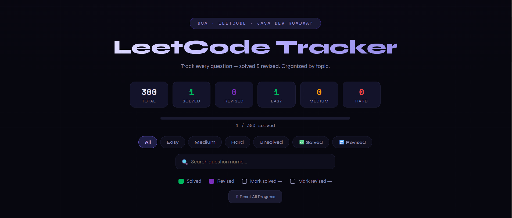
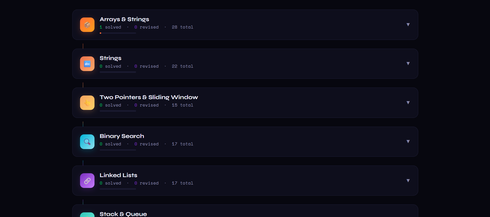

# 🚀 LeetCode Tracker — DSA Roadmap (Java Developer)

A clean and interactive **LeetCode Tracker Web App** to help you practice Data Structures & Algorithms in a **structured and consistent way**.

🔗 Live Demo: https://Sangamesh1805.github.io/Leetcode-Tracker/

---

## 📌 About the Project

While solving problems on LeetCode, I realized that tracking progress topic-wise and revising problems efficiently was difficult.

So I built this **LeetCode Tracker** to:

* Organize problems by topic
* Track solved and revised questions
* Maintain consistency in DSA preparation

---

## ✨ Features

* 📚 Topic-wise DSA roadmap (Arrays, DP, Graphs, etc.)
* ✅ Mark problems as **Solved**
* 🔁 Mark problems as **Revised**
* 📊 Real-time progress tracking (stats + progress bar)
* 🔍 Search functionality
* 🎯 Filters (Easy / Medium / Hard / Solved / Unsolved)
* 🎨 Clean and minimal dark UI

---

## 🛠️ Tech Stack

* HTML5
* CSS3
* JavaScript (Vanilla JS)

---

## 📸 Preview

---

## 🚀 How to Use

1. Open the live site
2. Browse problems topic-wise
3. Mark questions as:

   * ✅ Solved
   * 🔁 Revised
4. Track your progress using stats and filters

---

## 🤝 Contributing

Contributions are welcome!
If you have ideas or improvements, feel free to fork the repo and submit a PR.

---

## 👨‍💻 Author

**Sangamesh**

* GitHub: https://github.com/Sangamesh1805
* LinkedIn: https://linkedin.com/in/sangamesh-hudgikar

---

## ⭐ Support

If you found this project helpful, consider giving it a ⭐ on GitHub!

---
